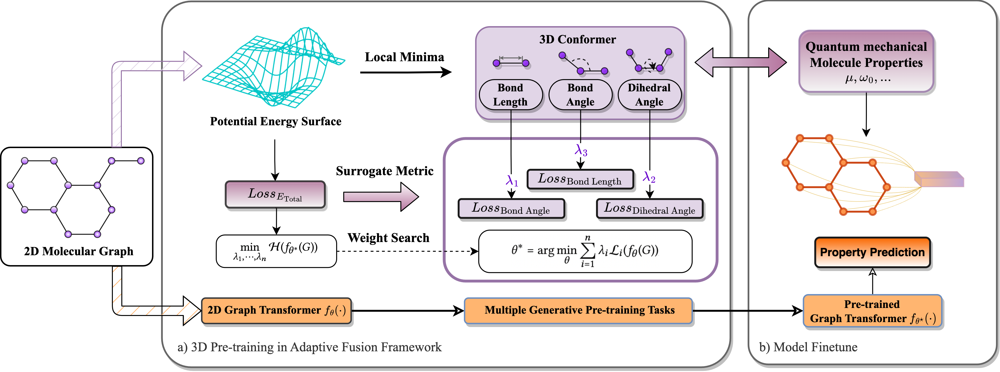

# Adaptive 3D Pre-training for Molecular Property Prediction



This repository provides the source code for 'Adaptive 3D Pre-Training for Molecular Property Prediction'. 3D PGT aims to use geometric information to design pre-training tasks to enhance the property prediction tasks of downstream 2D molecular graphs.
The whole process consists of two stages：
- In the 3D pre-training stage, 3D PGT performs several generative pre-training tasks on the dataset containing 3D information
- In the finetune stage, 3D PGT fine-tunes the pre-trained model on molecular datasets containing only 2D topological structures and performs property prediction tasks

## Requirements
```
python>=3.7, pytorch=1.10.0, pytorch_geometric==2.0.4, numpy>=1.21.2, pandas>=1.3.4
rdkit>=2022.9.3, scikit-learn>=1.1.2, ogb>=1.3.3
```

## Dataset Preprocessing
For dataset preprocessing in GEOM, please use the following commands:
```
python GEOM_dataset_preparation.py -n_mol $N_MOL --n_upper $N_UPPER --data_folder $ SLURM_TMPDIR
```
For [PCQM4Mv2](https://arxiv.org/abs/2103.09430) dataset, it is a recently published dataset for the OGB Large Scale Challenge built to aide the development of state-of-the-art machine learning models for molecular property prediction. The task is for the quantum chemistry task of predicting the [HOMO-LUMO energy gap](https://en.wikipedia.org/wiki/HOMO_and_LUMO) of a molecule.

## For 3D pre-training in 3D-PGT

You can implement adaptive 3D pre-training by running the following code:
```
# Running 3D PGT for pre-training on GEOM dataset
python pretrain_main.py --cfg configs/GPS/pre-train_Drugs.yaml wandb.use False

# Running 3D PGT for pre-training on PCQM4Mv2 dataset
python pretrain_main.py --cfg configs/GPS/pcqm4m-GPS.yaml wandb.use False
```
## For Downstream tasks

You can use the following code to ```finetune``` downstream tasks, but pay attention to setting the addresses of downstream task datasets and pre-trained model files in the ```config file```.
```
Running 3D PGT for finetuning on GEOM-Drugs dataset
python main.py --cfg configs/GPS/finetune_Drugs.yaml
```
